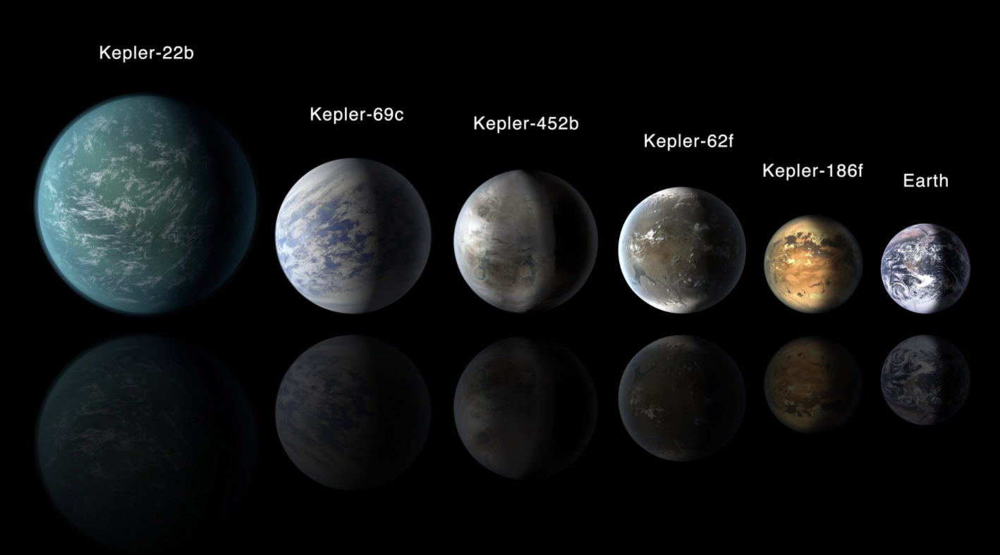

# Exoplanet Exploration: Classifying Exoplanets

## Project Overview

The goal of this project was to compare/contrast the efficiency and accuracy of various Machine Learning Classification models. Over a period of nine years in deep space, the NASA Kepler space telescope has been out on a planet-hunting mission to discover hidden planets outside of our solar system. Four machine learning models were used to classify candidate exoplanets from the raw [dataset](data/exoplanet_data.csv) provided by telescope: a Deep Learning neural network, a K Nearest Neighbors model, a Support Vector Machine, and a Random Forest. 

## Technologies Used

- Python
- Pandas
- Matplotlib
- Scikit-learn
- Tensorflow

## Classification Models

- Deep Learning
- K Nearest Neighbors
- Support Vector Machine
- Random Forest

## 

Model Performance Analysis/Comparison

Four machine learning models were used to classify exoplanets with the provided dataset: a Deep Learning neural network, a K Nearest Neighbors model, a Support Vector Machine, and a Random Forest. I had expected that the Deep Learning model would end of having the greatest percent accuracy in classifying exoplanets, but it turned out that my hypertuned Support Vector Machine model was slightly more accurate, with an accuracy of .883 vs the Deep Learning model's .881.

The datset had a very large number of features. I worked with the Random Forest model first, and used the feature_importance function to try to narrow down the number of features. However, they all seemed to have very low numbers with regard to importance. It was difficult to decide which subset was significantly more relevant than the others. I decided to try only using those that had an importance > .05, so I used the top five most important features. I went back through all the steps of creating a train test split and scaling the data. Ultimately, it was the very first Random Forest model I trained that had the highest accuracy (.87), before the hypertuning, which I found surprising. By comparison, the model I trained using the smaller subset of "most important" features had an accuracy of .85.

With the K Nearest Neighbors model, when plotting the test accuracy score with regard to number of nearest neighbors, I estimated that 13 nearest neighbors would provide the best model for classifying the data. This returned an accuracy score of .816. However, when I hypertuned the model, I found that 9 was actually the most appopriate number of neighbors to use, yielding an accuracy of .841.

Each of the models I used had a fairly high accuracy score, they were all greater than .80. With an accuracy score of .883 and .881, respectively, I think both my Support Vector Machine model and my Deep Learning model would be good enough to predict new exoplanets accurately most of the time. If I could figure out a better way to limit the subset of features to only the most important ones, I think my models could maybe be even more accurate and they would take far less time to train/hypertune. Training this amount of data and then running through all hypertune scenarios was certainly pretty time consuming. Playing with each individual model enough to optimize it was also decently time consuming, with more time I would've liked to test all possible Classification models to compare and contrast. 

